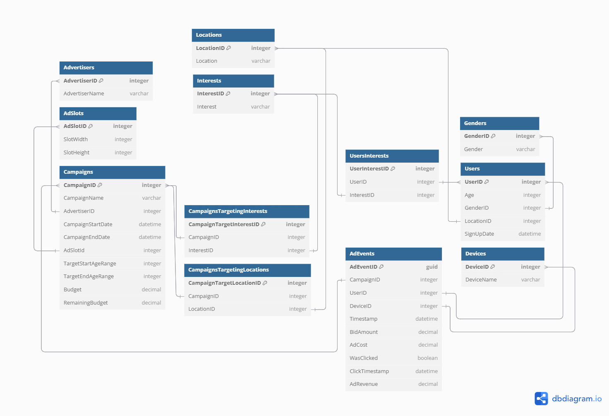

# Homework 1 - Data Normalization and preparation

This repository contains the deliverables for the Data Engineering homework #1 assignment.

---

## Table of Contents

1.  [Normalized Relational Schema and DDL Scripts](#1-normalized-relational-schema-and-ddl-scripts)
2.  [Local  Setup (Docker-compose/Shell Scripts)](#2-local-setup)
3.  [Data Verification Screenshot](#3-data-verification-screenshots)

---

## 1. Normalized Relational Schema and DDL Scripts

The schema follows 3NF principles to minimize redundancy and ensure data integrity.

The schema separates entities into distinct tables to eliminate data redundancy and maintain referential integrity, with lookup tables for genders, locations, interests, and devices to normalize categorical data and support efficient many-to-many relationships between users and their interests, as well as campaigns and their targeting criteria.

You can find the DDL (Data Definition Language) scripts for each table in the `src/schema.sql` directory, and all tables will bee create automatically within the Python script. The DB schema and queries are provided below:



### Database Tables

```sql
CREATE TABLE IF NOT EXISTS Genders (
    GenderID INT PRIMARY KEY AUTO_INCREMENT,
    Gender VARCHAR(50)
);
```
**Comment:** Normalizes gender data to avoid string repetition and ensures consistent gender values across the database.

```sql
CREATE TABLE IF NOT EXISTS Locations (
    LocationID INT PRIMARY KEY AUTO_INCREMENT,
    Location VARCHAR(50)
);
```
**Comment:** Centralizes location data to maintain consistency and reduce storage overhead from repeated location strings.

```sql
CREATE TABLE IF NOT EXISTS Interests (
    InterestID INT PRIMARY KEY AUTO_INCREMENT,
    Interest VARCHAR(50)
);
```
**Comment:** Creates a master list of interests to support many-to-many relationships between users and interests, and campaigns and targeted interests.

```sql
CREATE TABLE IF NOT EXISTS Devices (
    DeviceID INT PRIMARY KEY AUTO_INCREMENT,
    Device VARCHAR(255) NOT NULL
);
```
**Comment:** Normalizes device information to avoid redundant device name storage in the main events table.

#### Core Entity Tables
```sql
CREATE TABLE IF NOT EXISTS Users (
    UserID INT PRIMARY KEY AUTO_INCREMENT,
    Age INT,
    GenderID INT,
    FOREIGN KEY (GenderID) REFERENCES Genders(GenderID),
    LocationID INT,
    FOREIGN KEY (LocationID) REFERENCES Locations(LocationID),  
    SignupDate DATE
);
```
**Comment:** Stores user demographic information with foreign key relationships to normalized lookup tables for data consistency.

```sql
CREATE TABLE IF NOT EXISTS Advertisers (
    AdvertiserID INT PRIMARY KEY AUTO_INCREMENT,
    Advertiser VARCHAR(255) NOT NULL
);
```
**Comment:** Separates advertiser information to support multiple campaigns per advertiser and maintain advertiser data integrity.

```sql
CREATE TABLE IF NOT EXISTS AdSlotSizes (
    AdSlotSizeID INT PRIMARY KEY AUTO_INCREMENT,
    AdSlotWidth INT NOT NULL,
    AdSlotHeight INT NOT NULL
);
```
**Comment:** Normalizes ad slot dimensions to avoid duplicate size specifications and enable reusable ad slot configurations.

```sql
CREATE TABLE IF NOT EXISTS Campaigns (
    CampaignID INT PRIMARY KEY,
    CampaignName VARCHAR(255) NOT NULL,
    AdvertiserID INT NOT NULL,
    CampaignStartDate DATE NOT NULL,
    CampaignEndDate DATE NOT NULL,
    AdSlotSizeID INT NOT NULL,
    TargetAgeStart INT NOT NULL,
    TargetAgeEnd INT NOT NULL,
    Budget DECIMAL(15, 2),
    RemainingBudget DECIMAL(15, 2),
    FOREIGN KEY (AdvertiserID) REFERENCES Advertisers(AdvertiserID),
    FOREIGN KEY (AdSlotSizeID) REFERENCES AdSlotSizes(AdSlotSizeID)
);
```
**Comment:** Central campaign table linking to advertisers and ad slot sizes, with embedded age targeting for simple range queries.

```sql
CREATE TABLE IF NOT EXISTS UsersInterests (
    UserInterestID INT PRIMARY KEY AUTO_INCREMENT,
    UserID INT,
    FOREIGN KEY (UserID) REFERENCES Users(UserID),
    InterestID INT,
    FOREIGN KEY (InterestID) REFERENCES Interests(InterestID)
);
```
**Comment:** Implements many-to-many relationship between users and interests, allowing users to have multiple interests.

```sql
CREATE TABLE IF NOT EXISTS CampaignsTargetingInterests (
    CampaignTargetInterestID INT PRIMARY KEY AUTO_INCREMENT,
    CampaignID INT NOT NULL,
    InterestID INT NOT NULL,
    FOREIGN KEY (CampaignID) REFERENCES Campaigns(CampaignID),
    FOREIGN KEY (InterestID) REFERENCES Interests(InterestID)
);
```
**Comment:** Enables campaigns to target multiple interests through a normalized many-to-many relationship.

```sql
CREATE TABLE IF NOT EXISTS CampaignsTargetingLocations (
    CampaignTargetLocationID INT PRIMARY KEY AUTO_INCREMENT,
    CampaignID INT NOT NULL,
    LocationID INT NOT NULL,
    FOREIGN KEY (CampaignID) REFERENCES Campaigns(CampaignID),
    FOREIGN KEY (LocationID) REFERENCES Locations(LocationID)
);
```
**Comment:** Allows campaigns to target multiple geographic locations through a normalized relationship structure.

```sql
CREATE TABLE IF NOT EXISTS AdEvents (
    AdEventID CHAR(36) PRIMARY KEY,
    CampaignID INT,
    UserID INT,
    DeviceID INT,
    Timestamp DATETIME,
    BidAmount DECIMAL(10, 2),
    AdCost DECIMAL(10, 2),
    WasClicked BOOLEAN,
    ClickTimestamp DATETIME,
    AdRevenue DECIMAL(10, 2)
);
```
**Comment:** Stores individual ad interaction events with foreign key references to campaigns, users, and devices for comprehensive tracking and analysis.

